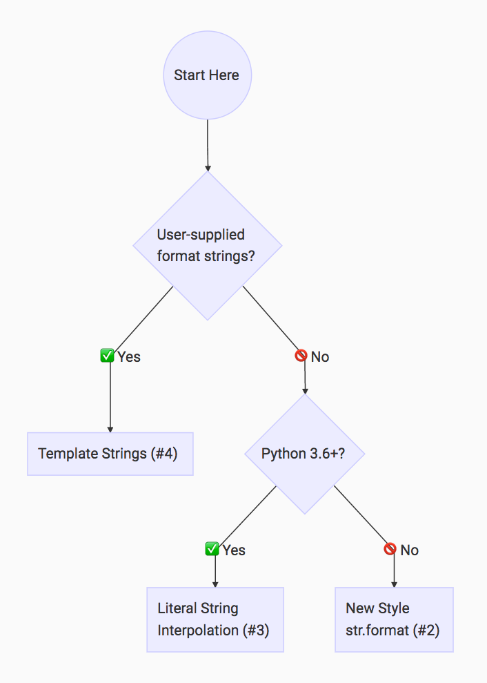

# Notes

* Chapterwise notes from the book **Learn to code in python3**

**NOTE**: `import this` - in the python console prints the **Zen of Python**

## Chapter 1

* Python is interpreted language.
* Group of statements form a block. Method/function comprises of blocks.
* Indentation very important for interpreter to identify tokens.

## Chapter 2

Identifier naming rules

* Identifier names case sensitive
* Start with either alphabets(lower and upper case) or underscore
* remaining characters can contain only alphabets, digits or underscore
* reserved words cannot be used as identifiers.
* `print` for console output and `input` for console input.
* `print('messsage', end='')` prints the message to console and ends with empty string. By default print method ends the string with new line.
* All reserved keywords are small case except the keywords **True** and **False**.
* Type conversions

```Python
# Returns True
bool('Hello')

# returns False
bool('')

# Converts to int
int('1')

float('1.234')

# eval converts input to appropriate type
# if we pass a string to eval and if the value is 4
# type is returned as int, if the value is 4.3 then the
# type of the returned variable is float.
x = '1'
# prints int
print(type(eval(x))
# eval is used for evaluating arithmetic expressions in a string
print(type(eval(" (12 * 5 + 100) / 3")))

x = '1.0'
# prints float
print(type(eval(x))

x = '12xf
# Error
print(type(eval(x)))
```

## Constants

A constant is a type of variable that holds values, which cannot be changed. Constants are usually declared and assigned on a different module/file.

```Python
# constants.py
PI = 3.14
GRAVITY = 9.8
```

```Python
#Inside main.py we import the constants
import constants
print(constants.PI)
print(constants.GRAVITY)
```

## Chapter 3

* The operators are
  * '+' addition
  * '-' subtraction
  * '*' multiplication
  * '/' floating point division. Returns the quotient of the division as a floating point
  * '//' Integer division. Returns the quotient of the division as integer.
  * '%' Modulus - returns the remainder of division
  * `**` exponent operator `a ** b` is interpreted as 'b' times 'a' or 'a' to the power of 'b'
  * unary '+' and '-'

* In python there is **no ++(increment) and --(decrement)**
* unary operators have higher precedence than binary operators and unary operators are right associative.
* Operator precednce - PEDMAS
    `P(paranthesis)E(Exponent)D(/, // and %)M(multiplication)A(addition)S(subtraction)`
* Division and multiplication same precedence and addition and subtraction in same precedence.
* All the binary operators are left associative except the assignment operator which is right associative.
* Chained assignment

  ```Python
  # Right most expression executed first
  a = b = c = d
  ```

* Arithmetic shorthand operators

  ```Python
  x *= 5 # same as x = x * 5
  ```

## Chapter 4 - Conditional expresssions

if syntax

```Python
# if block
if condition:
    block

#============================================
# if else
if condition:
  block
else:
  block

#============================================
# if else if else block
if condition:
  block
elif condition:
  block
else
  block

#============================================
# conditional expression
exp1 if condition else expr2

# example
result = (5 * 10) if eval(input('Enter number')) > 0 else 0
```

* **and**, **or**(n-ary operators) and **not**(unary) are the logical operators in python.

* no **case** statement in python.

* **pass** statement is a no-op statement in python. Helps to declare a no op loop or empty class

```Python
# example
if var == 5:
    pass

# empty class implementation
class EmptyClass:
    pass
```

## Chapter 5

Iteration syntax:

```Python
# while loop
while condition:
    # block

#============================================
# for loop
for loop_var in range(10):
    print(loop_var)
```

* **break**(exit out of the loop) and **continue**(skips an iteration) keywords exists in python.

## Chapter 6

Python has modules that consists of utility methods. Some of the useful python modules are math, time, random.

* **math** contains methods to find log, sqrt, power, trigonometric functions etc
* **random** contains methods like randint, randrange, seed, choice etc
* **time** module contains important methods sleep, clock etc
Synatx for importing methods inside modules

```Python
# Syntax to import specific methods only
from module import method1, method2

# aliasing
from module import method1 as my_method

# import all methods inside a module.
# this is not a recommended (its discouraged) as this may introduce
# ambiguity in methods named same in local program.
from module import *

# import the entire module
# Methods can be referred using the qualified name only.
# A methods qualified name is "module_name.method_name"
import module
```

## Chapter 7

User defined functions syntax

```Python
# return keyword to return result from a method.
def method_name(parameter_list):
    """
    Python docstring. Document what this function does.
    """
    # method_block
```

* Usually **main** method is written and treated as the driver to call in to other methods.
* Documentation string(short as doc string) in python is a string enclosed between ''' or """ and present in the beginning of a file or beginning of a function.
* The `None` keyword is used to define a null variable or an object. In Python, `None` keyword is an object, and it is a data type of the class `NoneType` . We can assign `None` to any variable, but you can not create other `NoneType` objects. **All variables that are assigned None point to the same object**.

## Chapter 8

* global variables are declared outside all the functions.
* **global** keyword declares global variables used inside a function.
* global variables usage **discouraged** inside functions
* Python supports default parameters. Non default parameters should come before default parameters.
* Function **overloading does not work in python** like in C++ or java. But we can define functions accepting variable parameters.

```Python
def say_hello(name = None):
    print("hello, {0}".format(name))

# using the default parameter value
say_hello()

# using the keyword argument
say_hello(name = "world")


def func(param1, *args):
    # args is a tuple
    print(type(args))
    for param in args:
        print(param)

func("param1", "param2", "param3")
# splatting list
func("param1", *["param2", "param3"])

#============================================
# **kwargs - is a dictionary
def func(param1, **kwargs):
    print(param1)
    for param in kwargs:
        print("Key: {0}, value: {1}".format(param, kwargs[param]))

func("Planets", first="Mercury", two= "Venus")
func("Planets", **{"first": "Mercury", "two": "Venus"})
```

* Function is a special kind of object. So to invoke a function always use paranthesis, otherwise the function object is referred to instead of invocation

```Python
print(type(sqrt))
# output will be <class ’builtin_function_or_method’>

name="John"
print(f"{name.lower} vs {name.lower()}")
```

* Function can be assigned to a variable and invoked through the variable.

  ```Python
  x = print
  x('hello world')  # prints 'hello world'
  ```

## Chapter 9

* list elements gets defined within []

```Python
lst = [1, 2, 3, 4, 5]
print(len(lst)) # prints the length of the list

# define empty list
empty_list = []

# list concatenation
list1 = [1,2,3]
list1 += [4] # list1 = list1 + [10] is also same
print(list1) # prints 1 2 3 4

# creating a list from range
list_range = list(range(10)) # creates a list containing integers from 0 to 9

# list element duplication
list1 = [0] * 10 # returns a list of size 10 filled with 0s
list2 = [1, 2] * 2  # list becomes [1, 2, 1, 2]
```

* lists are **mutable** data structures
* comparing list with equality operator(==) compares each element in the list.
* **is** operator checks if list1 is alias of list2, in other words if both the list variables point to the same list data structure in memory.
* **list_copy** functions copies the contents of input list and creates and returns a new list
* slicing the list `list[begin_index: end_index]`. Default begin_index is 0 and default end_index is length of the list to be sliced. Slices the array from begin index to (end index - 1).
* slice assignment

```Python
# how the slice assignment works
# first take the slice out of the list specified on the LHS
# then insert the list present on the RHS to the beginning index of the slice in he LHS list
lst = [1, 2, 3, 4, 5, 6]
lst[2: 5] = [10, 20, 30] # lst will now be [1, 2, 10, 20, 30, 6]
# note slice [3,4,5] is removed and new list elements are added/inserted at the slice start index.
lst[2:2] = [100] # lst will now contain [1,2,100,10,20,30,6]
# empty list sliced and new list elements inserted from index 2.
```

* lists passed to functions as parameters, the parameter variable becomes alias of the list passed.
* lists in python are mutable, heterogeneous (can contain objects of any type)

* Iterating over different collections

```Python
# Iterating over list
for element in [1, 2, 3]:
    print(element)

# Iterating over tuple
for element in (1, 2, 3):
    print(element)

# Iterating over dictionary
# Note that starting with Python 3.7, dictionary iteration order
# is guaranteed to be the same as the insertion order.
for key in {'one':1, 'two':2}:
    print(key)

# Iterating over String
for char in "123":
    print(char)

# Iterating over contents of file
for line in open("myfile.txt"):
    print(line, end='')
```

## Chapter 10

 Sample programs to work on lists

## Chapter 11

* Objects in python contains data and methods.
* Methods between __ (double underscores) is meant for objects internal use only. Clients should not call these methods.
* Str type/class contains useful methods like count, strip(equivalent to trim in java), lower, upper, startswith, endswith, find, format etc
* strings are **immutable**.
* lists contains methods like `insert`, `append`, `remove`, `index`, `sort`, `reverse` etc. Many of these methods modify the list itelf like insert, reverse, sort, append, remove etc

## Chapter 12

Custom type creation

```Python
# Syntax
class ClassName:
  # constructor/initializer
  def __init__(self, parameters):
    # Initialization block
  
  # to protect object attributes from external access,
  # prefix the attribute with the double underscore.
  # Such attributes cannot be accessed directly
  # from outside the objects of this class
```

* To every method inside the object,we pass a parameter conventionally called as **self** which refers to the object itslef.

* Inheritance syntax

```Python
class ChildClass(ParentClass):
    def __init__(self, parameters):
        # first invoke the base class constructor
        ParentClass.__init__(self, params)
        # Base class constructor can also be invoked like below
        # This is the python 2.x way of calling super()
        super(ChildClass, self).__init__(params)
        # Even simplifying, base class constructor can be invoked as below
        # this is the python 3.x way of calling super()
        super().__init__(params)
        # Child class constructor implementation follows
```

* Python supports multiple inheritance

```Python
# multiple inheritance syntax
class Subclass(SuperClass1, SuperClass2..):
    # class body

#=========================================================
# In case of method invocations in base class, the method is lookedup from left to right ordering of the parent classes and its hierarchy.

# This is how the diamond inheritance problem is handled
```

* When calling methods of objects, we dont need to pass the object explicitly(to satisfy the self param), because python passes the instance implicitly to the method.
* Any variable declared/defined in a class without self word becomes a class variable shared by all the instances of the class.

```Python
class SampleClass:
    # Public class variable shared by all instances.
    classPublicVar = "PublicVar"

    # Internal class variable shared by all instances.
    __classPrivateVar = "PrivateVar"

    # To access the class private variable
    def accessPrivateClassVariable(self):
        # self.__classPrivateVar
        SampleClass.__classPrivateVar
```

## Chapter 13 - Exception Handling

```Python
try:
    #try block
except <Error> as error_variable:
    # exception handling block

#==============================================

# handling all exceptions
try:
    # try block
except:
    # catches all
    pass

#===============================================
# try catch finally
try:
    # try block
except:
    # exceptin block
finally:

#================================================
# try except else finally
try:
  # code that may throw exception
except:
  # handle exceptions
else:
  # block to execute if try was successful
finally:
  # irrespective of exception raised or not, execute this code.
```

To throw exception, use `raise` keyword.

```Python
def getQuotient(num, den):
    if den == 0 :
        raise ZeroDivisionError
    return num / den
```

Custom exceptions should inherit from the `class Exception`

## String Interpolation

* Using **`%` formatting**. This is very old style. Recommended to use `str.format` starting python 3 or **f-strings** in newer versions(>=3.6).

```Python
first="mercury"
second="venus"
print("First planet from Sun: %s. Second planet is %s"%(first,second))

# readable and maintainable version
print("First planet from Sun: %(first)s. Second planet is %(second)s"%{"first":first, "second": second})
```

* Using `str.format` method

```Python
first="mercury"
second="venus"
print("First planet from Sun: {0}. Second planet is {1}".format(first,second))

# To move away from ordering of parameters
print("First planet from Sun: {first}. Second planet is {second}".format(second=second, first=first))
```

* Using **f-strings**. (Introduced in Python 3.6 onwards)

```Python
# Works with both single quotes and double quotes
name = 'World'
print(f'Hello {name}!')
print(f"Hello {name}!")

# Any python expression can be placed inside {}
print(f"Hello {name.upper()}!")
print(f"Result of 5 * 2 is {5 * 2}!")

# to print {} itself as part of the output, use **{{** **}}**
foo = "Hello"

# prints
# {
#     "foo": Hello
# }
print(f"""
{{
    "foo": {foo}
}}
    """)
```

* Using `Template` from string module.

```Python
from string import Template
name = 'John Doe'
age = 30
template = Template('Name: $name! Age: $age')
print(template.substitute(name = name,age = age))
```



---

## References

* Learn to code in python3 by Richard L.Halterman
* [Python3 documentation](https://docs.python.org/3/tutorial/classes.html)
* [String interpolation](https://realpython.com/python-string-formatting/)
