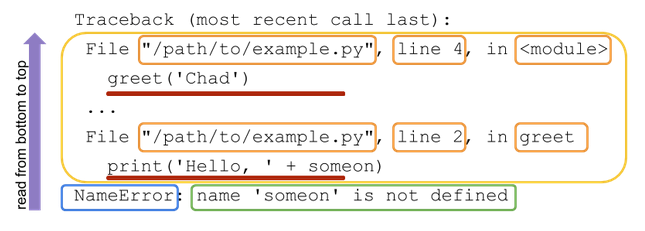

# Python traceback

* Traceback contains the stacktrace to the exception raised.
* Reading a traceback from the bottom up makies it easier to understand it.

```Python
def greet(someone):
    print('Hello, ' + someon)

greet('Chad')
```



* Last line of the traceback contains the exception type and its message.
* Next follows is the stack trace with most recently called code towards the bottom and least recent code at the top. This is incontrast to other programming languages where the stack trace is usually printed from top to bottom.

## Exception while handling another exception

```Python
# greetings.py
def who_to_greet(person):
    return person if person else input('Greet who? ')

def greet(someone, greeting='Hello'):
    print(greeting + ', ' + who_to_greet(someone))

def greet_many(people):
    for person in people:
        try:
            greet(person)
        except Exception:
            print('hi, ' + person)

greet_many(['Chad', 'Dan', 1])
```

* Python3 prints all the tracebacks. Moving up the tracebacks can help you understand the exception a lot better.

```text
$ python greetings.py
Hello, Chad
Hello, Dan
Traceback (most recent call last):
  File "greetings.py", line 10, in greet_many
    greet(person)
  File "greetings.py", line 5, in greet
    print(greeting + ', ' + who_to_greet(someone))
TypeError: must be str, not int

During handling of the above exception, another exception occurred:

Traceback (most recent call last):
  File "greetings.py", line 14, in <module>
    greet_many(['Chad', 'Dan', 1])
  File "greetings.py", line 12, in greet_many
    print('hi, ' + person)
TypeError: must be str, not int
```

## Common tracebacks

* `AttributeError` - Raised when an attribute reference or assignment fails.

* `ImportError` - Raised when the import statement has troubles trying to load a module. Also raised when the ‘from list’ in from ... import has a name that cannot be found.

* `IndexError` - Raised when a sequence subscript is out of range.

* `KeyError` - Raised when a mapping (dictionary) key is not found in the set of existing keys.

* `NameError` - Raised when a local or global name is not found.

* `SyntaxError` - Raised when the parser encounters a syntax error.

* `TypeError` - Raised when an operation or function is applied to an object of inappropriate type.

* `ValueError` - Raised when an operation or function receives an argument that has the right type but an inappropriate value, and the situation is not described by a more precise exception such as IndexError.

## Logging a traceback

* `logger.exception()` logs the exception traceback to the **stderr** by default.

```Python
import logging

logger = logging.getLogger(__name__)

try:
    # some code that may result in an exception
except SomeException as e:
    logger.exception()
    # exception handling logic
else:
    # on successful execution
```

* Python’s built-in `traceback` module can be used to work with and inspect tracebacks.

---

## References

* [Python exceptions](https://docs.python.org/3/library/exceptions.html)
* [Traceback in Python](https://realpython.com/python-traceback/)
