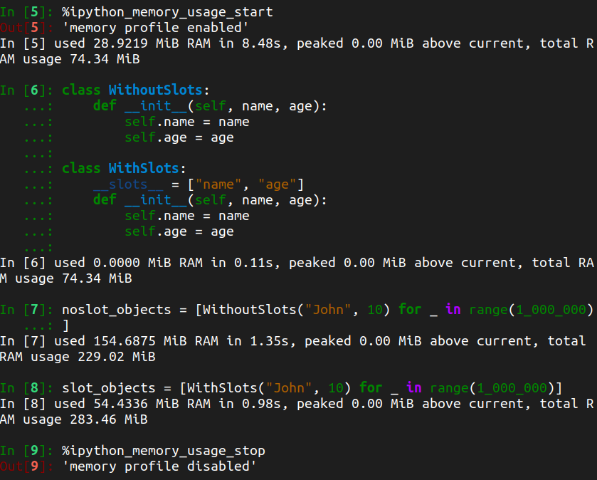

# Slots for dynamicall

* In python, objects use `dict` for attribute storage. This attribute dictionary can be accessed by `obj.__dict__`.
* Using `dict` for attribute storage allows the object to have attributes added dynamically.
* With **slots** we fix the attributes on an object during its creation. No more dynamic addition of attributes is allowed.
* Also the attributes on the objects using slots cannot be removed as well.

## Slots usage

* Classes should define their attribute names in either a list or tuple and assign it to `__slots__` class attribute.

```Python
class SimpleClass:
    __slots__ = ["attr"]
    def __init__(self, attr):
        self.attr = attr

sc = SimpleClass("some value")
print(sc.attr)
print(dir(sc))
try:
    # as we know vars will fetch the contents of __dict__
    # When using slots, the object doesnot have this attribute
    vars(sc)
except TypeError:
    pass

# trying to add an  attribute dynamically on the object
# This will raise AttributeError
sc.dyn_attr = "hello"
```

## Advantages of using slots

* Fast attribute access compared to `dict`.

* For objects whose attributes are limited and well known, using dictionary could be memory expensive. This would bite use even more when we are [creating large number of such objects](https://book.pythontips.com/en/latest/__slots__magic.html#slots-magic).

* To verify the memory usage with ipython, we need the [**ipython_memory_usage**](https://github.com/ianozsvald/ipython_memory_usage) package. Use `pip install ipython_memory_usage`

```Python
import ipython_memory_usage

class WithoutSlots:
    def __init__(self, name, age):
        self.name = name
        self.age = age

class WithSlots:
    __slots__ = ["name", "age"]
    def __init__(self, name, age):
        self.name = name
        self.age = age

%ipython_memory_usage_start

# create a million objects
noslot_objects = [WithoutSlots("John", 10) for _ in range(1_000_000)]

# create a million objects
slot_objects = [WithSlots("John", 10) for _ in range(1_000_000)]

%ipython_memory_usage_start
```



## Inheritance using slot classes

```Python
class SlotsBase:
    __slots__ = ["parent_attr"]

    def __init__(self, val):
        self.parent_attr = val

class SlotsChild(SlotsBase):
    __slots__ = ["child_attr"]

    def __init__(self, child_val, **kwargs):
        self.child_attr = child_val
        super().__init__(**kwargs)

c = SlotsChild(child_val=1, val=2)
c.parent_attr
c.child_attr
```

* If the base class doesnot define `__slots__`, then it will have `__dict__` attribute and that will be inherited by classes that inherit from it.

* If the parent has `__slots__` defined but the derived class doesnot, then the derived class gets `__dict__` attribute.

* Basically this tells, that subclasses using slots need not necessarily inherit only from base classes using slots.

## Special notes on using slots

* Accessing uninitialized attribute on class using slots raises `AttributeError`

```Python
class ClassUsingSlots:
    __slots__ = ["attr"]

obj = ClassUsingSlots()

# raises AttributeError
obj.attr

obj.attr = "something"

print(obj.attr)
```

* We can add `__dict__` attribute to the class using the `__slots__`.

```Python
class WithDictAndSlots:
    __slots__ = ["__dict__", "name", "age"]
    def __init__(self, name, age):
        self.name = name
        self.age = age

obj = WithDictAndSlots("John", 10)
obj.dyn_attr = "Hello"
vars(obj)
```

> __slots__ are implemented at the class level by creating descriptors (3.4.2) for each variable name. As a result, class attributes cannot be used to set default values for instance variables defined by __slots__; otherwise, the class attribute would overwrite the descriptor assignment.- [Slots](https://www.thomas-cokelaer.info/tutorials/python/slots.html)

* We can’t inherit a built-in type such as `int`, `bytes`, `tuple` with non-empty `__slots__`. We can assign a default value to attributes in `__slots__` in `__init__()` and not directly.

---

## References

* [Slots Documentation](https://docs.python.org/2.5/ref/slots.html)
* [Slots Introduction](https://www.python-course.eu/python3_slots.php)
* [Slots performance and deep dive into slot's CPython internals](https://blog.usejournal.com/a-quick-dive-into-pythons-slots-72cdc2d334e)
* [Inheritance using slots](https://towardsdatascience.com/understand-slots-in-python-e3081ef5196d)
