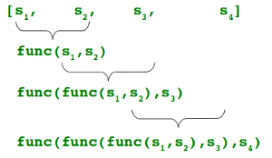

# Lambda (anonymous functions)

* Anonymous throw away functionc commonly used with `map()`, `filter()` and `reduce()`.
* `reduce()` is available under the module **functools**
* Lambda function syntax: `lambda parameters: expression`
* Restricted to contain only a single expression.
* Function objects can be returned from the lambda functions.

```Python
import functools

sum = lambda a, b: a + b
numbers = [1, 2 , 3, 4, 5]

print(f"Sum: {functools.reduce(sum, numbers)}")
```

## `map()` function

* Syntax: `map(func, seq1, seq2)`. This method returns an iterator in python3

* The function can be a normal function or a lambda function.

* The function to the map operates on every element in the sequence.

```Python
number_strings = ["100", "200", "300"]

numbers = map(lambda s: int(s), number_strings)
print(type(numbers)) # class 'map'
print(list(numbers))
```

* `map()` can be applied to multiple sequences. The sequences need not be of same length. In case of sequences of varying length, map will operate till the minimum length out of these sequences.

```Python
seq1 = [ 1, 2, 3, 4 ]
seq2 = [ 4, 3, 2]

sum_list = map(lambda a, b: a + b, seq1, seq2)

# outputs [5, 5, 5]
print(list(sum_list))
```

## Mapping an input with a list of functions

* Apply a list of functions to a input

```Python
double = lambda x: x * 2
square = lambda x: x ** 2

def map_functions(n, functions):
    return [func(n) for func in functions]

map_functions(10, [double, square])
```

## `filter()`

* Syntax: `filter(function, sequence)`
* Returns only those elements in the sequence for which the function returns `True`
* Filter can be applied only to a single sequence.

```Python
numbers = list(range(-10, 10))
pos_numbers = filter(lambda n: n >= 0, numbers)

for posn in pos_numbers:
    print(posn)
```

## `reduce()`

* Syntax: `reduce(func, seq)`
* Returns a single value.
* The function should accept two arguments of the same type and should return a result of the same type.

* 

```Python
from functools import reduce
f = lambda a,b: a if (a > b) else b
reduce(f, [47,11,42,102,13])
```

---

## References

* [Lambda, map, filter and reduce functions](https://www.python-course.eu/python3_lambda.php)
