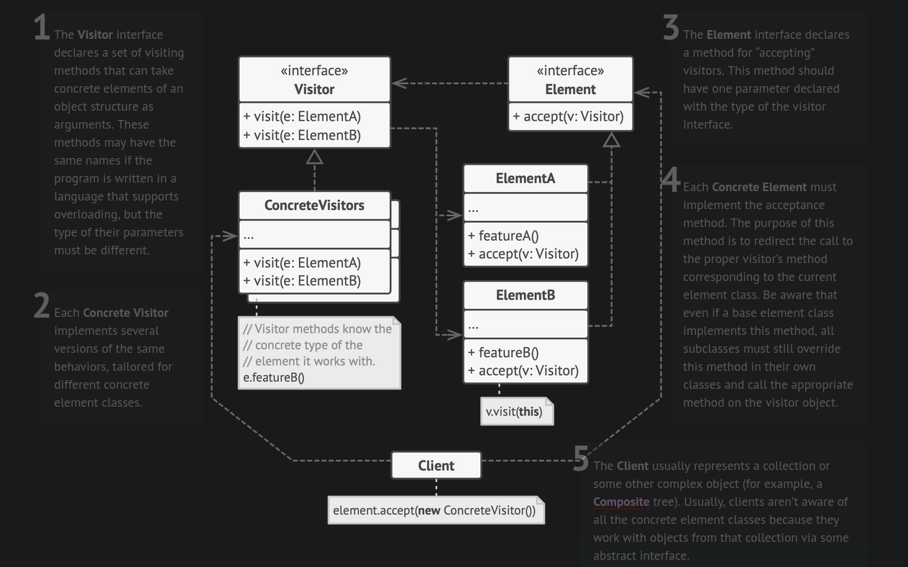

# Visitor Pattern

- Visitor object will be passed to many objects, so that each object can call the required operation on the visitor object.

- Since the visitor object visits every object, its referred to as visitor design pattern.

- Using this pattern, each object can invoke method relevant to it. Otherwise if we have pass these objects to visitor, then visitor would need to examine the type of each of the object to perform the required operation.

- This would break the open/closed princile in SOLID.

## Structure

---

## References

- [Visitor Pattern](https://refactoring.guru/design-patterns/visitor)
