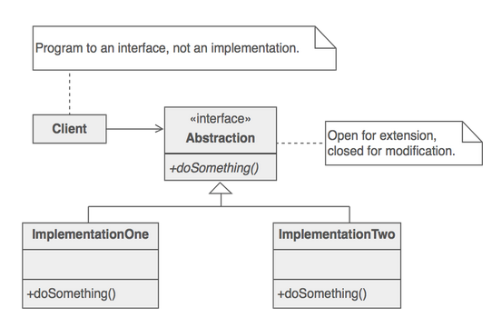

# Strategy design pattern

> Define a family of algorithms, encapsulate each one, and make them interchangeable. Strategy lets the algorithm vary independently from the clients that use it.

- When we have different algorithms that does a similar thing, we can define an interface(abstraction) that hide the different algorithm implementations(derived classes) to the client.

- For instance, we have many algorithms that can be used to digitally sign a data. Depending on the client's request we can get the required algorithm.

- Different clients may use different algorithms but all through the same interface.

- This pattern promotes the concept of **maximizing cohesion and minimize coupling**.

- Abstract coupling - **Program to an interface, not an implementation**

## Example

- [Strategy pattern example](https://github.com/faif/python-patterns/blob/master/patterns/behavioral/strategy.py)

Python's first-class functions allow us to implement the strategy pattern in a more straightforward way.

- We could define algorithm objects with `__call__` method and pass those objects to the client.
- We could define all strategies as top level functions and pass the function to the client.
- We can create abstract base classes and then appropriate derived classes and pass the right instance to the client.

## Relation with other patterns

- Client can also use an abstract factory to get an instance of the strategy object.

- Decorator lets you change the skin of an object, while Strategy lets you change the guts.

---

## References

- [Strategy pattern](https://sourcemaking.com/design_patterns/strategy)

- [Python3 Object oriented programming by Dusty Phillips](https://www.amazon.in/dp/B005O9OFWQ/ref=dp-kindle-redirect?_encoding=UTF8&btkr=1)
