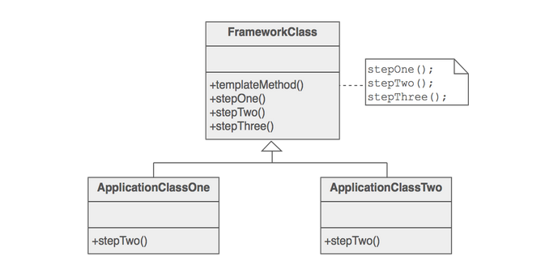

# Template method pattern

* Defines the skeleton of a base algorithm, deferring definition of exact
steps to subclasses.

* Two different components have significant similarities, but demonstrate no reuse of common interface or implementation. If a change common to both components becomes necessary, duplicate effort must be expended.

* The component designer decides which steps of an algorithm are **invariant** (or standard), and which are **variant** (or customizable). The invariant steps are implemented in an abstract base class, while the variant steps are either given a default implementation, or no implementation at all. The variant steps represent "hooks", or "placeholders", that can, or must, be supplied by the component's client in a concrete derived class.

* This patterns is predominantly used in frameworks.

## Example

* [Example of template method pattern](https://github.com/faif/python-patterns/blob/master/patterns/behavioral/template.py)

## Rules of thumb

* In strategy, we select an algorithm from a variety of algorithms, while in template we customize the steps of a same algorithm

* Template uses inheritance to customize an algorithm, while strategy uses delegation to select an algorithm.

* Factory method pattern can now be viewed as a special case of template method pattern, where subclasses override only the steps involving creation part.

---

## References

* [Template design pattern](https://sourcemaking.com/design_patterns/template_method)

* [Python3 Object oriented programming by Dusty Phillips](https://www.amazon.in/dp/B005O9OFWQ/ref=dp-kindle-redirect?_encoding=UTF8&btkr=1)
