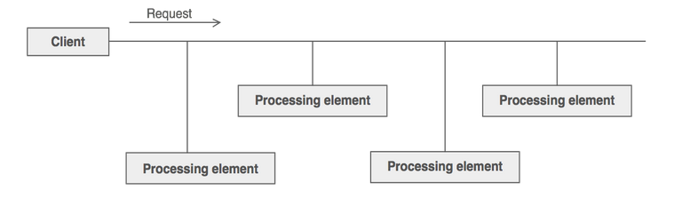
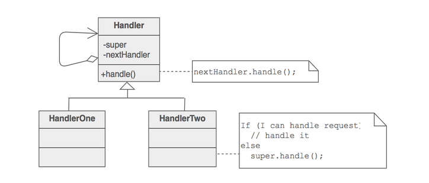

# Chain of responsibility pattern

* Decouple sender from the receiver. Sender will just have a handle to the abstraction.

* Internally there could be many receivers behind the abstraction.

* The chaining mechanism uses recursive composition to allow an unlimited number of handlers to be linked.

* Through recursive composition, the request passes from one request to the another. The request can be handled by one or more receivers.

## Implementation

* Each sender keeps a single reference to the head of the chain, and each receiver keeps a single reference to its immediate successor in the chain.

* Make sure there exists a "safety net" to "catch" any requests which go unhandled.

## Rules of thumb

* Chain of responsibility can use **Command to represent the request object**.

---

## References

* [Chain of responsibility pattern](https://sourcemaking.com/design_patterns/chain_of_responsibility)

* [Chain of responsibility example](https://github.com/faif/python-patterns/blob/master/patterns/behavioral/chain_of_responsibility.py)
