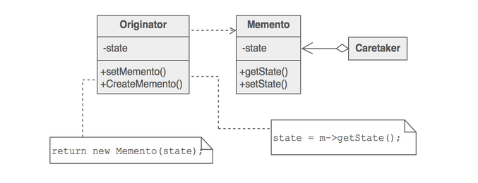
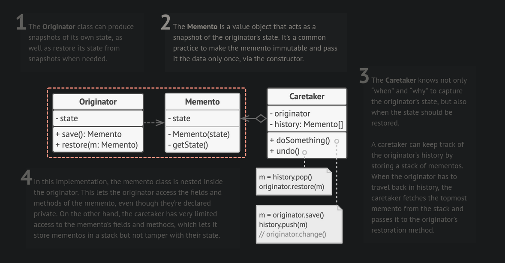
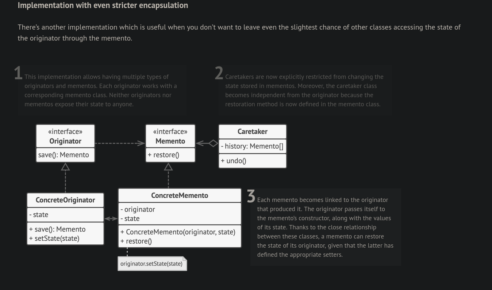

# Memento design pattern

- Objects should be able to store their internal state externally and allow restoration to that state in later time.

- Object state serialization and deserialization

- Originator - Object whose state needs to be saved and restored in a later point in time.
- Caretaker - One that instructs the originator to create a memento. Also manages the memento
- Memento - State of originator. Memento object is usually **immutable**.

- Restoring an object state to an earlier point in time(rollback) can be achieved using this pattern.

## Implementation

## Example

- [Memento pattern example](https://github.com/faif/python-patterns/blob/master/patterns/behavioral/memento.py)

---

## References

- [Memento Design pattern](https://sourcemaking.com/design_patterns/memento)

- [Memento Design pattern: Refactoring Guru](https://refactoring.guru/design-patterns/memento)
