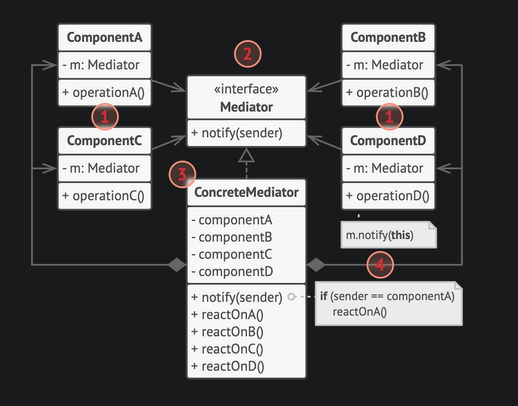

# Mediator Pattern

- Objects instead of communicating directly, communicate via a mediator object.

## Structure

## Examples

- [Mediator Design Pattern example](https://github.com/faif/python-patterns/blob/master/patterns/behavioral/mediator.py)

- > Pilots of aircraft that approach or depart the airport control area don’t communicate directly with each other. Instead, they speak to an air traffic controller, who sits in a tall tower somewhere near the airstrip. Without the air traffic controller, pilots would need to be aware of every plane in the vicinity of the airport, discussing landing priorities with a committee of dozens of other pilots. That would probably skyrocket the airplane crash statistics.

## Usage

- Use the Mediator pattern when it’s hard to change some of the classes because they are tightly coupled to a bunch of other classes.
- Use the Mediator when you can’t reuse a component in a different program because it’s too dependent on other components.
- Use the Mediator when you find yourself creating tons of component subclasses just to reuse some basic behavior in various contexts.

---

## References

- [Mediator Design Pattern](https://refactoring.guru/design-patterns/mediator)
