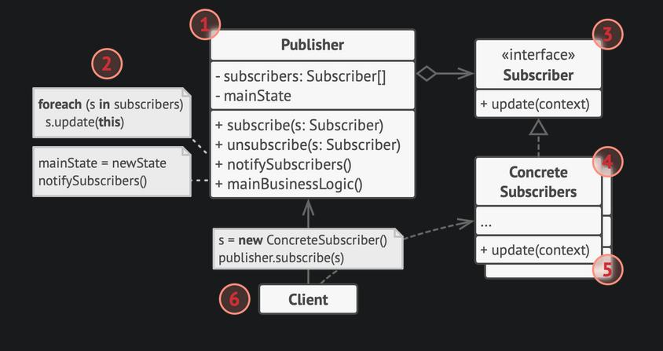

# Observer pattern

- Define a subscription mechanism by which multiple objects can be notified when any event occurs.

- Published will notify subscribers when its state changes.

> The Observer pattern suggests that you add a subscription mechanism to the publisher class so individual objects can subscribe to or unsubscribe from a stream of events coming from that publisher. Fear not! Everything isn’t as complicated as it sounds. In reality, this mechanism consists of 1) an array field for storing a list of references to subscriber objects and 2) several public methods which allow adding subscribers to and removing them from that list.
> All subscribers implement the same interface and that the publisher communicates with them only via that interface. This interface should declare the notification method along with a set of parameters that the publisher can use to pass some contextual data along with the notification.
> If your app has several different types of publishers and you want to make your subscribers compatible with all of them, you can go even further and make all publishers follow the same interface. This interface would only need to describe a few subscription methods. The interface would allow subscribers to observe publishers’ states without coupling to their concrete classes.

## Implementation

## Example

- [Observer pattern example](https://github.com/faif/python-patterns/blob/master/patterns/behavioral/observer.py)

## Usage

- Use the Observer pattern when changes to the state of one object may require changing other objects, and the actual set of objects is unknown beforehand or changes dynamically.

---

## References

- [Observer design pattern](https://refactoring.guru/design-patterns/observer)
