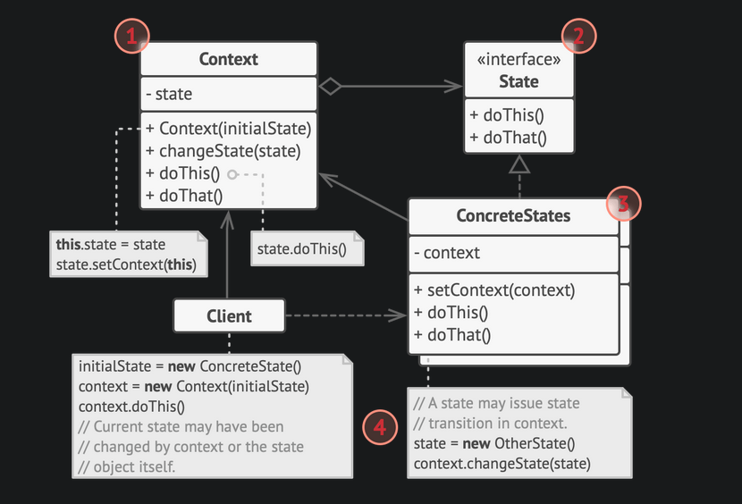

# State pattern

- When an object needs to change its behavior based on its internal state, we can use state pattern to model that object.
- State pattern closely follows finite state machines.
- In state pattern, we create a common interface for all states and each state will have its own concrete implementation of that interface.
- Each state will contain what it needs to do.
- The Original object referred to as context will always contain a reference to the current state it is in.
- All work involved in transitioning to another state is delegated from the context object to its current state object, since it knows what needs to be done for state transition and which states it can transition to.

## State vs Strategy

- States can be aware of each other, while strategies are never aware of each other's existence.

## Applicability

- Use the State pattern when you have an object that behaves differently depending on its current state, the number of states is enormous, and the state-specific code changes frequently.

- Use the pattern when you have a class polluted with massive conditionals that alter how the class behaves according to the current values of the class’s fields.

- Use State when you have a lot of duplicate code across similar states and transitions of a condition-based state machine.

## Example implementation

- [State pattern example](https://github.com/faif/python-patterns/blob/master/patterns/behavioral/state.py)

---

## References

- [State pattern](https://refactoring.guru/design-patterns/state)
