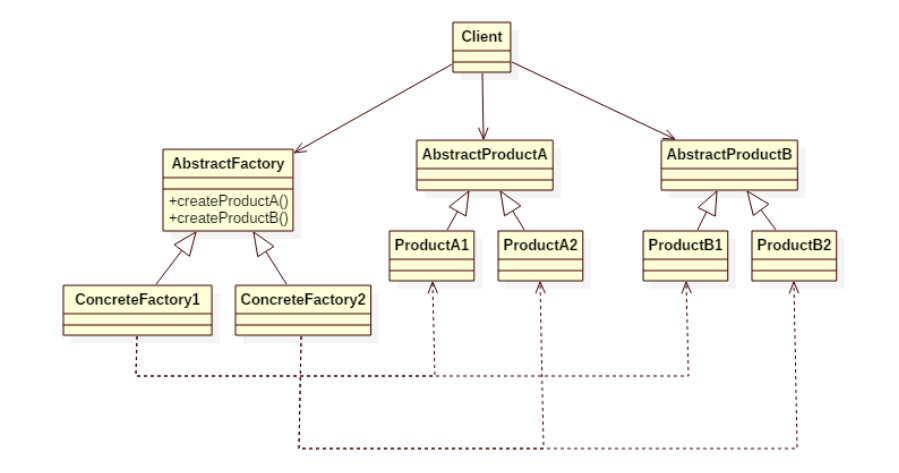

# Abstract factory pattern

- This pattern is very well explained in the [book](<(https://www.amazon.in/dp/B005O9OFWQ/ref=dp-kindle-redirect?_encoding=UTF8&btkr=1)>) with a very good example. So refer to the book for illustration with an example.

**NOTE**: Use the materials in the references section to understand this pattern.

## Intent

This design pattern abstracts the factory object that is going to be used for creating objects. **This patterns deals with families of factory objects**. Each factory will deal with the creation of a set of related or dependent objects.



## When to use this pattern

- In scenarios where you have to choose an implementation based on a criteria like operating system, database backends, localizations etc.

- Abstract factory will abstract the creation of the object based on the settings in the application configuration or environment variables etc.

- Client will never request for a particular concrete implementation.

## Example

- Suppose you want to create a socket object as well as file object on multiple operating systems.
- Abstract factory in this case will define methods like `createSocket`, `createFile`, while the concrete factories will be created for each of the OS windows, linux and unix.
- Based on the configuration or environment variable, appropriate concrete factory will be instantiated and that will be used by the client.

```Python
# This snippet is just to give an idea on abstract factory pattern
# Do not look in to the logical correctness of the below snippet.

# installer.py
import sys

# Each installer classes are themselves a factory
# since classes in python are callable.

class WinInstallerFactory:
    """
        This factory object knows how to create installer objects
        for installing softwares x and y on windows platform
    """
    def create_x_installer(self):
        return WinXInstaller()
    def create_y_installer(self):
        return WinYInstaller()

class LinuxInstaller:
    def create_x_installer(self):
        return LinuxXInstaller()
    def create_y_installer(self):
        return LinuxYInstaller()

class UnixInstaller:
    def create_x_installer(self):
        return UnixXInstaller()
    def create_y_installer(self):
        return UnixYInstaller()

# This map stores singleton factory objects per platform
INSTALLERS = {
    "windows": WinInstaller(),
    "linux": LinuxInstaller(),
    "unix": UnixInstaller()
}

current_installer = INSTALLERS[sys.platform]

# main.py
from installer import current_installer
# Here the client does not know which factory is used for
# creating the XInstaller and YInstaller
current_installer.create_x_installer().install()
current_installer.create_y_installer().install()
```

Diagramatic representation of another example that closely resembles the above code snippet.


## Example 3

- Refer to [Python3 Object oriented programming by Dusty Phillips](https://www.amazon.in/dp/B005O9OFWQ/ref=dp-kindle-redirect?_encoding=UTF8&btkr=1) for a nice example on selection of date and currency formatters based on the locale setting.

## Abstract factory pattern implementation in python

The article [Abstract factory pattern explained](https://python-patterns.guide/gang-of-four/abstract-factory/) **very nicely** explains why we can use callables as factories in python compared to having an abstract factory interface in typed languages like Java.

> The Abstract Factory is an awkward workaround for the lack of first-class functions and classes in less powerful programming languages. It is a poor fit for Python, where we can instead simply pass a class or a factory function when a library needs to create objects on our behalf. - [Abstract factory pattern](https://python-patterns.guide/gang-of-four/abstract-factory/)

The following restrictions in python will make abstract factory resemble very similar to that of Java or C#

- Restriction-1: Callables cannot be passed as arguments
- Restriction-2: Classes cannot be passed as arguments
- Restriction-3: Factory objects have to be subclasses of a particular base type(Needed in statically typed languages).

- Because of the above mentioned capabilities available in python, abstract factory implementation becomes very simplified. Factories need not use inheritance, but as long as they honor duck typing the amount of boilerplate code is reduced compared to Java or C#.
- Example snippet in this [**article**](https://python-3-patterns-idioms-test.readthedocs.io/en/latest/Factory.html#abstract-factories) captures the abstract factory pattern implementation in java style and in python style.

**CATCH:** If we are actively **using type hinting in python**, then the codebase will look similar to that of Java in terms of requiring an abstract base class and subclasses implementing those abstract behaviour.

---

## References

- [Python3 Object oriented programming by Dusty Phillips](https://www.amazon.in/dp/B005O9OFWQ/ref=dp-kindle-redirect?_encoding=UTF8&btkr=1)

- [Abstract factory pattern](https://github.com/faif/python-patterns/blob/master/patterns/creational/abstract_factory.py)

- [Abstract factory pattern explained](https://python-patterns.guide/gang-of-four/abstract-factory/)
