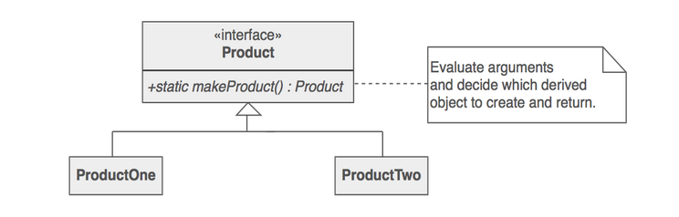
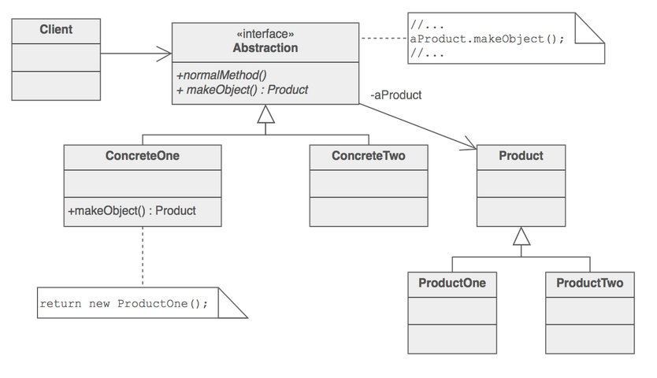

# Factory Method Design Pattern

* Keep object creation logic of all new types at one place(common factory) and rest of the application use the factory to create the objects
* Reduces the amount of code that needs to be changed when adding a new type.
* Calling a factory method creates and returns a concrete implementation of an interface/abstract base class.

## Simple factory



```Python
class Shape:
    # This method is an example of simple factory method
    @staticmethod
    def getShape(name: str) -> 'Shape':
        if name == 'Circle':
            return Circle()
        elif name == 'Square':
            return Square()
        else:
            raise ValueError("Unknown Shape")

class Circle:
    pass

class Square:
    pass
```

* [Simple factory example](https://github.com/faif/python-patterns/blob/master/patterns/creational/factory.py) is also an example of simple factory method.

## Polymorphic Factory method



```Python
class A:
    def doSomething(self):
        f = self._makeFoo()
        f.whatever()

    def _makeFoo(self):
        return RegularFoo()

class B(A):
    def _makeFoo(self):
        #subclass is overriding the factory method
        #to return something different
        return SpecialFoo()

```

But the above implementation **is not pythonic**. We can live without subclassing but still have a factory method. [This article](https://python-patterns.guide/gang-of-four/factory-method/#the-factory-method-pattern) explains very nicely about more pythonic implementations of factory method pattern.

## Pythonic way of implementing factory method pattern

* If you know all the dependent objects prior, then using dependency injection is better.

> The “Factory Method” pattern is a poor fit for Python. It was designed for underpowered programming languages where classes and functions can’t be passed as parameters or stored as attributes. In those languages, the Factory Method serves as an awkward but necessary escape route. But it’s not a good design for Python applications. - [Factory method pattern in python](https://python-patterns.guide/gang-of-four/factory-method/#the-factory-method-pattern)

* Since we can pass any callable (be it class or function, class instances) in python, factory pattern implementation becomes much simpler.

```Python
# Notice in the below methods, we pass the factory method(callable)
# to the JSONDecoder instead of creating subclasses of JSONDecoder
# to customize it. This approach is considered more pythonic.
from decimal import Decimal
from json import JSONDecoder
from decimal import Context, ROUND_DOWN
from functools import partial

# Method1
my_decoder1 = JSONDecoder(parse_float=Decimal)

# Method2
def parse_number(string):
    if '.' in string:
        return Decimal(string)
    return int(string)
my_decoder2 = JSONDecoder(parse_float=parse_number)

# Method3
parse_number_partial = partial(Decimal, context=Context(2, ROUND_DOWN))
my_decoder3 = JSONDecoder(parse_float=parse_number_partial)
```

## Difference between a factory method and an abstract factory

> * The main difference between a "factory method" and an "abstract factory" is that the factory method is a single method, and an abstract factory is an object that has multiple factory methods on it.
> * Factory Method pattern hides the construction of a single object whereas Abstract Factory hides the construction of a family of related objects.
>
> -[Differences between Abstract Factory and Factory design patterns](https://stackoverflow.com/questions/5739611/what-are-the-differences-between-abstract-factory-and-factory-design-patterns?rq=1)

---

## References

* [Factory Method Design Pattern](https://sourcemaking.com/design_patterns/factory_method)
* [Factory pattern implementation example](https://github.com/faif/python-patterns/blob/master/patterns/creational/factory.py)
* [Factory: Encapsulating Object Creation](https://python-3-patterns-idioms-test.readthedocs.io/en/latest/Factory.html)
* [The Factory Method Pattern](https://python-patterns.guide/gang-of-four/factory-method/)
