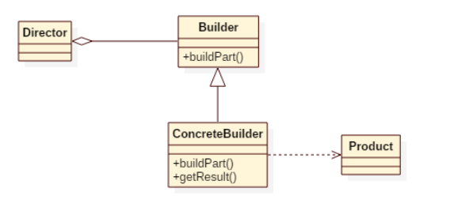

# Builder pattern

* **Separate the construction of a complex object from its representation** so that the same construction process can create different representations.

* The "builder" creates part of the complex object each time it is called and maintains all intermediate state. When the product is finished, the client retrieves the result from the "builder".

**NOTE**: This [section of the article](https://python-patterns.guide/gang-of-four/builder/#a-degenerate-case-simulating-optional-arguments) very nicely explains a common usecase for builder pattern.

## Components of builder pattern

* Director (client)
* Reader - One which parses the representation. This component is optional.
* Builder - Interface the contains the steps to build the object



## Builder vs Abstract factory

* Abstract factory knows how to build different related products, where as builder is used to build a single product in many stages.

* Builder often builds a Composite.

> Builder focuses on constructing a complex object step by step. Abstract Factory emphasizes a family of product objects (either simple or complex). Builder returns the product as a final step, but as far as the Abstract Factory is concerned, the product gets returned immediately.

## Pythonic implementation

* In most cases, make use of python's default parameters and keyword arguments to provide only the parameters we need and skip the other ones with defaults. This [stackoverflow thread](https://stackoverflow.com/questions/11351032/namedtuple-and-default-values-for-optional-keyword-arguments) explains various ways of using optional arguments

* (Requires Python 3.7 and above)Prefer using dataclasses with default values populated.

```Python
from dataclasses import dataclass
from typing import Any

@dataclass
class Node:
    val: Any = None
    left: 'Node' = None
    right: 'Node' = None

Node()
Node(val=None, left=None, right=None)
```

* In cases where we need to build different hierarchy of products in multiple stages, we can opt for the builder pattern recommended by GOF. A reference implementation of such usecase can be found [here](https://github.com/faif/python-patterns/blob/master/patterns/creational/builder.py)

---

## References

* [Builder design pattern](https://sourcemaking.com/design_patterns/builder)
* [Builder pattern example](https://github.com/faif/python-patterns/blob/master/patterns/creational/builder.py)
* [Builder pattern in python](https://python-patterns.guide/gang-of-four/builder/)
