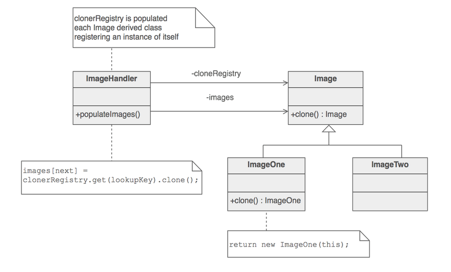

# Prototype pattern

* Using a prototypical instance, we create other instances instead of creating using `new`

* In scenarios where the object creation is expensive, we can clone a prototype instance and customize few parameters based on our need.

* In python we can use the **copy module**'s `copy` and `deepcopy` methods to shallow and deep clone objects respectively in many cases.

* In cases where we need to clone the objects in a special way that cannot be done through the above mentioned methods in the copy module, we can implement this design pattern as per the below technique.

## Implementation

This is just an example implementation case.

* Abstract base class with `clone()` method. This can also maintain a registry of its concrete classes and their prototypical instance.

* All subclasses will implement the `clone` method and also will register their prototype instance.

* Client calls a factory method on the abstract base class specifying the concrete class whose instance it needs. Then the factory can return a new instance by cloning the appropriate prototype instance from the registry.

Example implementation adhering to the above steps can be found [**here**](https://github.com/faif/python-patterns/blob/master/patterns/creational/prototype.py)

## Prototype pattern in python

---

## References

* [Prototype pattern](https://sourcemaking.com/design_patterns/prototype)
* [Prototype pattern example](https://github.com/faif/python-patterns/blob/master/patterns/creational/prototype.py)
* [Prototype design pattern review in python](https://python-patterns.guide/gang-of-four/prototype/)
