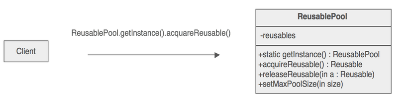

# Object Pool pattern

## When to use this pattern

* When the cost of initializing a class instance is high
* When the rate of instantiation of a class is high and
* When the number of instantiations in use at any one time is low.

## Implementation

* Often object pool class is singleton

* Object pool manager can create additional instances when required and clean up unused objects periodically.

* The **Factory Method pattern** can be used to encapsulate the creation logic for objects(reusables) that will be managed by the object pool.

---

## References

* [Object pool pattern](https://sourcemaking.com/design_patterns/object_pool)
* [Object pool implementation example](https://github.com/faif/python-patterns/blob/master/patterns/creational/pool.py)
