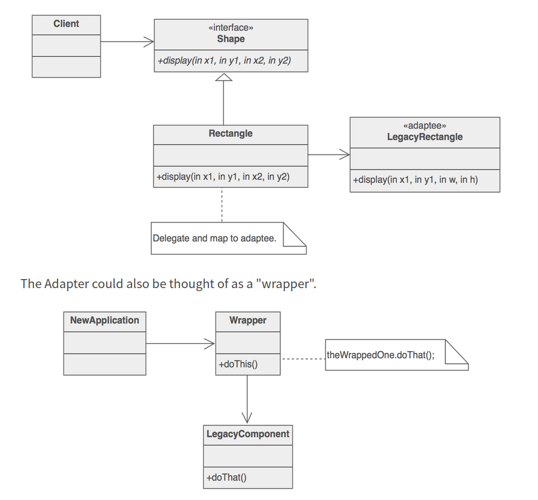

# Adapter pattern

* Wraps an existing class(implementation) providing it a new interface.

> Clients call methods on the Adapter object which redirects them into calls to the legacy component. This strategy can be implemented either with inheritance or with aggregation.

* Aggregation is often preferred over inheritance.

* Adapting may entail a variety of tasks, such as converting arguments to a different format, rearranging the order of arguments, calling a differently named method, or supplying default arguments.

For various techniques on implementing adapter pattern we can look in to [this article](https://python-3-patterns-idioms-test.readthedocs.io/en/latest/ChangeInterface.html#adapter)

---

## References

* [Adapter design pattern](https://sourcemaking.com/design_patterns/adapter)
* [Python3 Object oriented programming by Dusty Phillips](https://www.amazon.in/dp/B005O9OFWQ/ref=dp-kindle-redirect?_encoding=UTF8&btkr=1)
* [Example implementation in python](https://github.com/faif/python-patterns/blob/master/patterns/structural/adapter.py)
* [Composition over inheritance](https://python-patterns.guide/gang-of-four/composition-over-inheritance/)
* [Adapter pattern: Patterns and Idioms by Bruce Eckel](https://python-3-patterns-idioms-test.readthedocs.io/en/latest/ChangeInterface.html)
