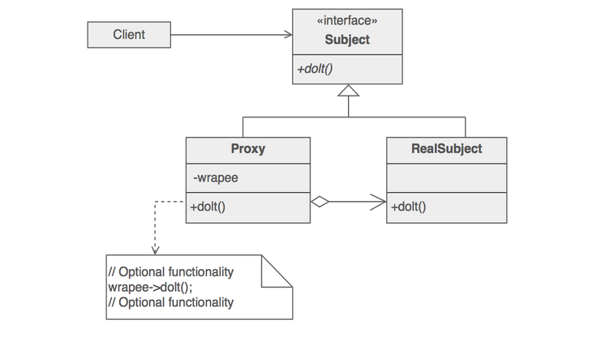
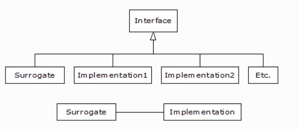

# Proxy design pattern

> Proxy is used in places where you want to add functionality to a class without changing its interface. The main class is called **Real Subject**. A client should use the proxy or the real subject without any code change, so both must have the same interface. **Logging and controlling access** to the real subject are some of the proxy pattern usages.

* Here a proxy object(surrogate) implements the same interface as that of the object(Real subject) that it encapsulates.

* Since the proxy object implements the same interface, all calls from the client can be delegated to the encapsulated object.



* Factory can be used to decide whether to instantiate actual object or the proxy object.

* Proxy often restricts the client the access to the real subject.

* Proxy pattern often uses composition.

> Proxies vary in the degree to which they are implemented like a decorator. A protection proxy might be implemented exactly like a decorator. On the other hand, a remote proxy will not contain a direct reference to its real subject but only an indirect reference, such as "host ID and local address on host." A virtual proxy will start off with an indirect reference such as a file name but will eventually obtain and use a direct reference. - [GOF]

## Usecases

* This pattern helps to **create resource intensive objects lazily** when the client first accesses them.
* Local Stub to access remote object
* Protective proxy - check access permissions of client to the underlying object.
* Smart proxy - reference count tracking, logging, thread safety, lazy load

## Difference from other structural patterns

> Adapter provides a different interface to its subject. Proxy provides the same interface. Decorator provides an enhanced interface. Decorator informs and empowers its client, Proxy restricts and disempowers its client.
> Although decorators can have similar implementations as proxies, decorators have a different purpose. A decorator adds one or more responsibilities to an object, whereas a proxy controls access to an object. - [GOF]

## Example



Simple implementation of the above classes is given in the below snippet.

```Python
# Simple demonstration of the Proxy pattern.

class Implementation:
    def f(self):
        print("Implementation.f()")
    def g(self):
        print("Implementation.g()")
    def h(self):
        print("Implementation.h()")

class Proxy:
    def __init__(self):
        self.__implementation = Implementation()
    # Pass method calls to the implementation:
    def f(self): self.__implementation.f()
    def g(self): self.__implementation.g()
    def h(self): self.__implementation.h()

p = Proxy()
p.f(); p.g(); p.h()
```

More pythonic implementation can be achieved using the `__getattr__` magic method. This is a very generic implementation that is agnostic of the interface implemented by the **real subject**.

```Python
class Implementation2:
    def f(self):
        print("Implementation.f()")
    def g(self):
        print("Implementation.g()")
    def h(self):
        print("Implementation.h()")

class Proxy2:
    def __init__(self):
        self.__implementation = Implementation2()
    def __getattr__(self, name):
        return getattr(self.__implementation, name)

p = Proxy2()
p.f(); p.g(); p.h();
```

---

## References

* [Proxy design pattern](https://sourcemaking.com/design_patterns/proxy)
* [Proxy pattern example](https://github.com/faif/python-patterns/blob/master/patterns/structural/proxy.py)
* [Proxy pattern: Idioms and patterns](https://python-3-patterns-idioms-test.readthedocs.io/en/latest/Fronting.html)
