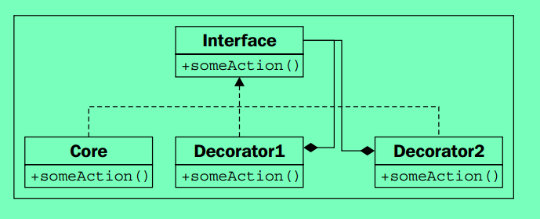
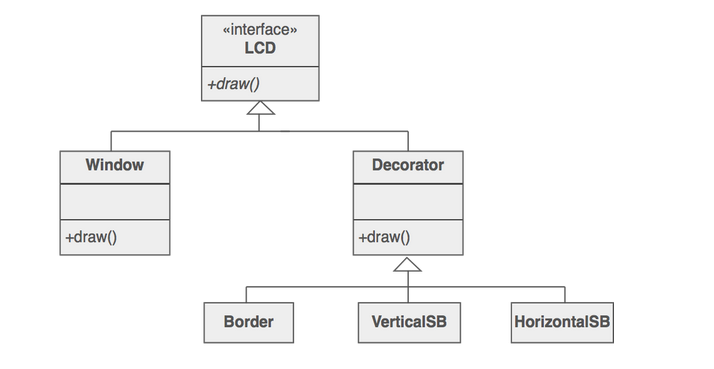

# Decorator pattern

> The “Decorator Pattern” != Python “decorators”!

Decorator implements the same interface as the object that it is decorating, but while enhancing the decorated objects functionality.

The Decorator pattern is used to dynamically add a new feature to an object without changing its implementation. It differs from inheritance because the **new feature is added only to that particular object, not to the entire subclass**.

## Implementation model 1



## Implementation model 2



## Decorator vs inheritance

> The Decorator Pattern can be useful in Python code! Happily, the pattern can be easier to implement in a dynamic language like Python than in the static languages where it was first practiced. Use it on the rare occasion when you need to **adjust the behavior of an object that you can’t subclass** but can only wrap at runtime.

* If we already have an **object** and we want to enhance its functionality dynamically during runtime, we will use the decorator pattern. The decorator will hold a reference to the object being decorated(aggregation).

* For instance, if we already have an input stream object that lacks reading one line at a time, then we will create a buffered input stream decorator that encloses the input stream that we have and provides methods for reading one line at a time. `BufferedInputstream(InputStream)`

* If we don't have an object already, but want one to be created dynamically in the runtime, then we will go for **inheritance**(specialization).

## Example

```Python
# this example follows the model 1
class TextTag:
    """Represents a base text tag"""

    def __init__(self, text):
        self._text = text

    def render(self):
        return self._text


class BoldWrapper(TextTag):
    """Wraps a tag in <b>"""

    def __init__(self, wrapped):
        self._wrapped = wrapped

    def render(self):
        return "<b>{}</b>".format(self._wrapped.render())


class ItalicWrapper(TextTag):
    """Wraps a tag in <i>"""

    def __init__(self, wrapped):
        self._wrapped = wrapped

    def render(self):
        return "<i>{}</i>".format(self._wrapped.render())
```

* Very nice example illustration with python code snippet is provided [here](https://python-3-patterns-idioms-test.readthedocs.io/en/latest/Decorator.html#compromise). The example in this reference follows **implementation model 2**

## [Rules of thumb](https://sourcemaking.com/design_patterns/decorator)

* Decorator enhances an object's responsibilities. Decorator is thus more transparent to the client.

* Decorator and Proxy have different purposes but similar structures. Both describe how to provide a level of indirection to another object, and the implementations keep a reference to the object to which they forward requests.

**NOTE**: [This article](https://python-patterns.guide/gang-of-four/decorator-pattern/) discusses various approaches with which we can implement the decorator pattern in python.

---

## References

* [Basics of decorator pattern](https://sourcemaking.com/design_patterns/decorator)
* [Python3 Object oriented programming by Dusty Phillips](https://www.amazon.in/dp/B005O9OFWQ/ref=dp-kindle-redirect?_encoding=UTF8&btkr=1)
* [Decorator pattern: Python patterns guide](https://python-patterns.guide/gang-of-four/decorator-pattern/)
* [Example implementation in python](https://github.com/faif/python-patterns/blob/master/patterns/structural/decorator.py)
* [Decorator pattern: Python patterns and idioms by Bruce Eckel](https://python-3-patterns-idioms-test.readthedocs.io/en/latest/Decorator.html)
* [Composition over inheritance](https://python-patterns.guide/gang-of-four/composition-over-inheritance/)
