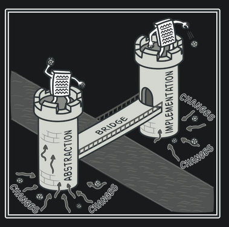
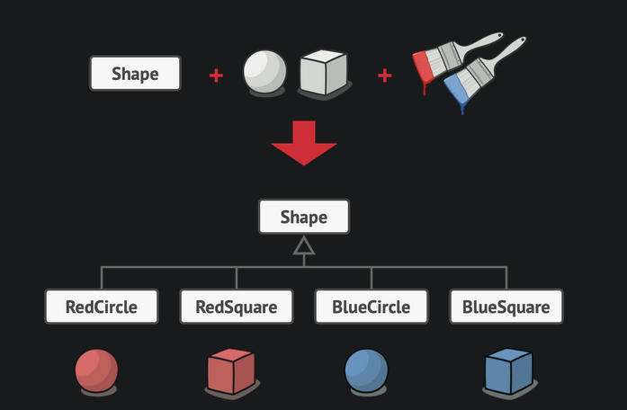
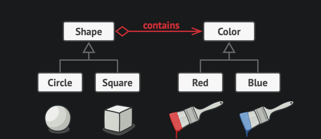
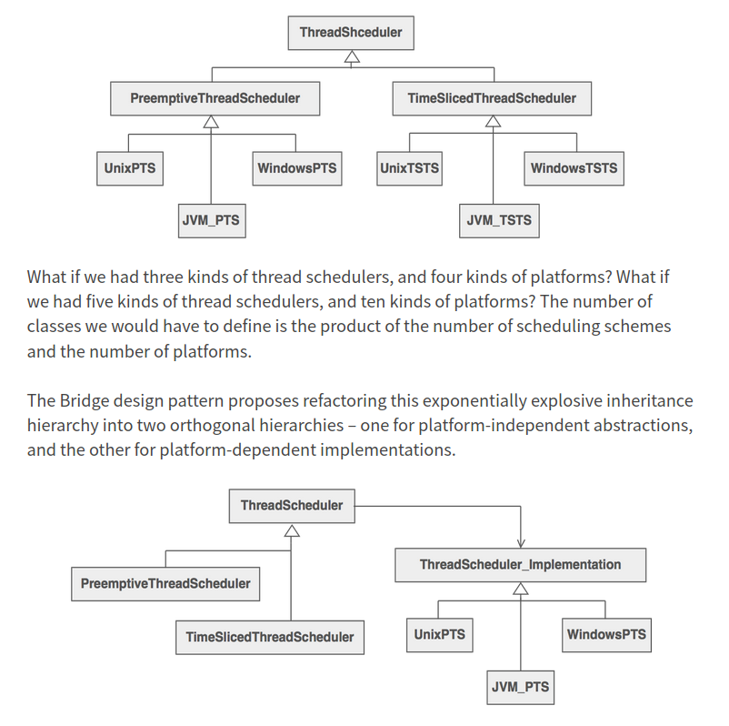

# Bridge pattern

- Separate abstraction from its implementation.

- Abstraction (also called interface) is a high-level control layer for some entity. This layer isn’t supposed to do any real work on its own. It should delegate the work to the implementation layer (also called platform).

- Helps to flatten the proliferation of classes whenever a new specialization of the abstraction or a new platform is added. From (m \* n) to (m + n)

- Abstraction(interface) hierarchy can grow independently from the platform hierarchy(implementation)

- The independent concepts could also referred to as: abstraction/platform, domain/infrastructure, front-end/back-end or interface/implementation.

## Examples

### Example-1

Read more about this example from [here](https://refactoring.guru/design-patterns/bridge)

### Example-2

**NOTE**: Refer to this well writtern article on [bridge pattern](https://sourcemaking.com/design_patterns/bridge). I have stored a copy in [my pocket library as well](https://app.getpocket.com/read/11409567)

## Implementation notes

- Often interface/abstraction contains a handle to the concrete implementation.
- To instantiate the right concrete implementation, interface/abstraction uses abstract factory.
- Client always interacts with the interface only.

## Sample snippets

- [Bridge pattern example](https://sourcemaking.com/design_patterns/bridge/python/1)
- [Bridge pattern example in python](https://github.com/faif/python-patterns/blob/master/patterns/structural/bridge.py)

---

## References

- [Bridge pattern](https://sourcemaking.com/design_patterns/bridge)
- [Composition over inheritance](https://python-patterns.guide/gang-of-four/composition-over-inheritance/)
