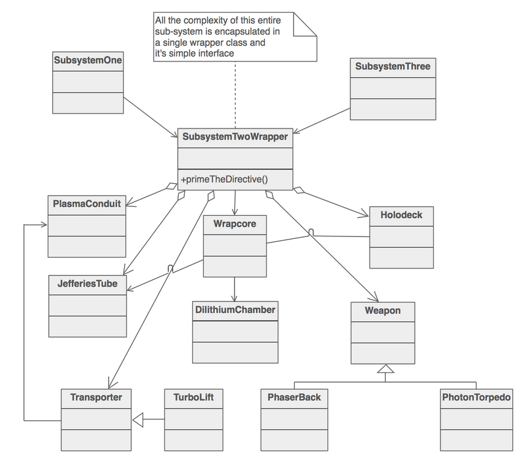

# Facade pattern

* Wraps set of interfaces behind a unified interface making it easier for the clients to use the subsystem.

* Facade **does not hide the subsystem** and make itself the only way to access to subsystem. Facade object should just be a facilitator and not a **god** object.



## Example implementation

```Python
"""
Provide a unified interface to a set of interfaces in a subsystem.
Facade defines a higher-level interface that makes the subsystem easier
to use.
"""


class Facade:
    """
    Know which subsystem classes are responsible for a request.
    Delegate client requests to appropriate subsystem objects.
    """

    def __init__(self):
        self._subsystem_1 = Subsystem1()
        self._subsystem_2 = Subsystem2()

    def operation(self):
        self._subsystem_1.operation1()
        self._subsystem_1.operation2()
        self._subsystem_2.operation1()
        self._subsystem_2.operation2()


class Subsystem1:
    """
    Implement subsystem functionality.
    Handle work assigned by the Facade object.
    Have no knowledge of the facade; that is, they keep no references to
    it.
    """

    def operation1(self):
        pass

    def operation2(self):
        pass


class Subsystem2:
    """
    Implement subsystem functionality.
    Handle work assigned by the Facade object.
    Have no knowledge of the facade; that is, they keep no references to
    it.
    """

    def operation1(self):
        pass

    def operation2(self):
        pass


def main():
    facade = Facade()
    facade.operation()


if __name__ == "__main__":
    main()
```

## Rules of thumb

* Facade deals with providing simpler interface while adapter provides client compatible interface.

* Facade objects are often singletons.

* Subsystem classes are unaware of the existance of a facade.

## References

* [Facade design pattern](https://sourcemaking.com/design_patterns/facade)
* [Python3 Object oriented programming by Dusty Phillips](https://www.amazon.in/dp/B005O9OFWQ/ref=dp-kindle-redirect?_encoding=UTF8&btkr=1)
* [Facade pattern example](https://github.com/faif/python-patterns/blob/master/patterns/structural/facade.py)
