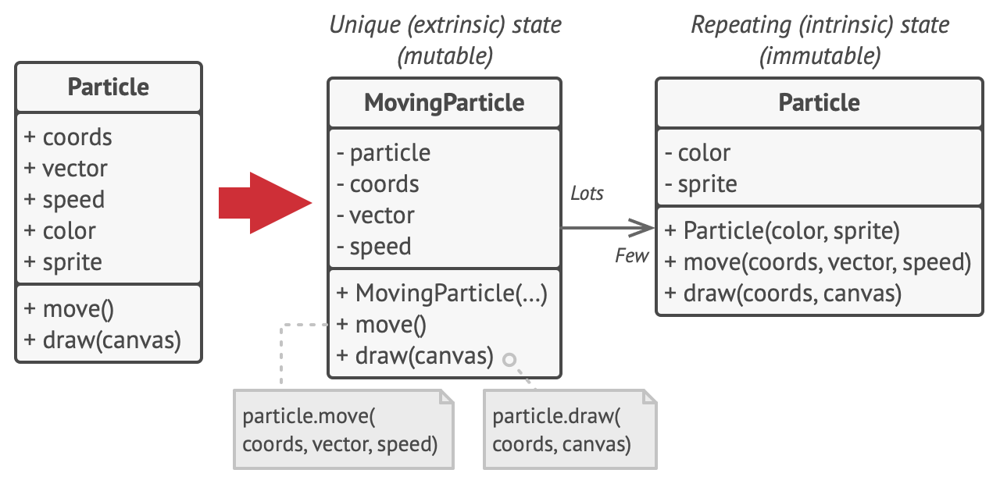

# Flyweight pattern

- **Intent**: Use sharing to support large numbers of fine-grained objects efficiently

- Memory optimization pattern. When a program needs to create a large number of objects at runtime, we can minimize the object creation using this pattern.

- This pattern separates the shareable state (**intrinsic state**) from non shareable state(**extrinsic state**) of a object.

- Extrinsic state is provided by the clients. Since intrinsic state is shareable, we can reuse already created objects(maintain a cache of flyweight objects).

- Often the clients access **flyweights through a factory**.

- Flyweight objects are often **immutable**.

> This pattern is often implemented only after a program has demonstrated memory problems.It may make sense to design an optimal configuration from the beginning in some situations, but bear in mind that premature optimization is the most effective way to create a program that is too complicated to maintain - [Python 3 OOP Dusty Philips]

## Examples

### Example1

> For example, when designing a word processor application, you might create an object for each character typed. Each Character object might contain information such as the font face, size and weight of each character. The problem here is that a lengthy document might contain tens of thousands of characters, and objects - quite a memory killer! The Flyweight pattern addresses the problem by creating a new object to store such information, which is shared by all characters with the same formatting. So, if I had a ten-thousand word document, with 800 characters in Bold Times-New-Roman, these 800 characters would contain a reference to a flyweight object that stores their common formatting information. The key here is that you only store the information once, so memory consumption is greatly reduced. -- [Wiki C2 Flyweight - TobinHarris](http://wiki.c2.com/?FlyweightPattern)

### [Example2](https://refactoring.guru/design-patterns/flyweight)

### Additional examples

- [Flyweight pattern Playing card example explained](http://codesnipers.com/?q=python-flyweights)

## Usage

- The Flyweight pattern is often combined with the **Composite Pattern** to implement a logically hierarchical structure in terms of a directed-acyclic graph with shared leaf nodes.

- It's often best to implement **State Pattern and Strategy Pattern** objects as flyweights.

## Flyweight factory

> For more convenient access to various flyweights, you can create a factory method that manages a pool of existing flyweight objects. The method accepts the intrinsic state of the desired flyweight from a client, looks for an existing flyweight object matching this state, and returns it if it was found. If not, it creates a new flyweight and adds it to the pool. - [Flyweight](https://refactoring.guru/design-patterns/flyweight)

**NOTE**- Here the flyweight object is identified by its intrinsic state.

- [Reference implementation of flyweight objects with pooling](https://github.com/faif/python-patterns/blob/master/patterns/structural/flyweight.py)

- Implementing using `__new__` is not considered readable. Hence a traditional **Flyweight Pattern factory** function is recommended.

## Flyweight in Python

[This article by Brandon Rhodes on flyweight pattern](https://python-patterns.guide/gang-of-four/flyweight/) very nicely explains the pattern and its usage in python language itself.

---

## References

- [Python3 Object oriented programming by Dusty Phillips](https://www.amazon.in/dp/B005O9OFWQ/ref=dp-kindle-redirect?_encoding=UTF8&btkr=1)
- [Python patterns Brandon Rhodes: Flyweight pattern review](https://python-patterns.guide/gang-of-four/flyweight/)
