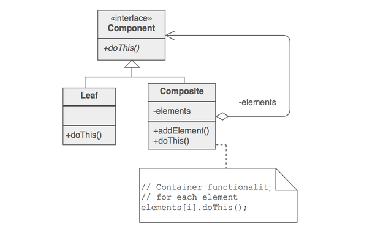

# Composite pattern

## Intent

* Compose objects into tree structures to represent whole-part hierarchies.
* Composite pattern lets clients treat **individual objects and compositions of objects uniformly**.
* In a hierarchy, we can have simple objects as well as composite objects. For instance in a file system, files are simple/primitive objects and folders are composite objects. Directories contain entries, each of which could be a directory.

## Examples

> The composite pattern is extremely useful for a variety of tree-like structures, including GUI widget hierarchies, file hierarchies, tree sets, graphs, and HTML DOM. - [Python 3 OOP][1]

* [GOF Design patterns](https://infinitescript.com/2014/10/the-23-gang-of-three-design-patterns/)
* [Composite pattern example](https://github.com/faif/python-patterns/blob/master/patterns/structural/composite.py)

## Implementation Checklist

* Create a **lowest common denominator** interface that makes your containers and containees interchangeable. It should specify the behavior that needs to be exercised uniformly across all containee and container objects.
* All container and containee classes declare an "is a" relationship to the interface.
* All container classes declare a one-to-many "has a" relationship to the interface.
* Container classes leverage polymorphism to delegate to their containee objects.

> It can be a useful pattern in Python when implemented according to the traditional implementation. Sometimes, if only a shallow tree is being created, we can get away with a list of lists or a dictionary of dictionaries, and do not need to implement custom component, leaf, and composite classes. Other times, we can get away with implementing only one composite class, and treating leaf and composite objects as a single class. - [Python 3 OOP][1]

## Python Implementation

[This article][2] explains the composite pattern in python with implementation details.

> The art of using the Composite Pattern is determining where to break the symmetry.
> The question of return type will serve as a very important guardrail when you are designing in Python: if your desire to create symmetry between container and content leads you to engineer calls that require an if statement or isinstance() to safely handle their return value, then the desire for symmetry has led you astray.

---

> Python supports many approaches:
>
> * The classic common superclass architecture.
> * Making the superclass an abstract base class with the tools inside Standard Library’s `abc` module.
> * Having the two classes share an interface, like those supported by the old [**zope.interface**](https://github.com/zopefoundation/zope.interface) package.
> * You could spin up a type checking library like **MyPy** and use annotations to ask for hard guarantees that all of the objects processed by your code — both container and contents — implement the runtime behaviors that your code requires.
> * You could duck type

**NOTE**: [zope.interface](https://github.com/zopefoundation/zope.interface) implements **interface** semantically similar to what we have in Java or C#. Its documentation can be found [here](https://zopeinterface.readthedocs.io/en/latest/)

---

## References

Read the following references in the same order as listed below to gain a better understanding of this pattern.

* [Composite Design Pattern](https://sourcemaking.com/design_patterns/composite)
* [Python3 Object oriented programming by Dusty Phillips][1]
* [Composite pattern : Python patterns guide Brandon Rhodes][2]

[1]: https://www.amazon.in/dp/B005O9OFWQ/ref=dp-kindle-redirect?_encoding=UTF8&btkr=1
[2]: https://python-patterns.guide/gang-of-four/composite/
